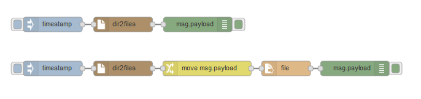

node-red-contrib-dir2files
====

Node-RED node that searches files in a directory and return paths which can be filtered by regex.

## Description

fucntions

- filter filenames by regex
- search files recursively or not
- select output array type or string type

## Usage

You can import the example flow from examples/example.json to your Node-RED.

## Install

## Licence

[Apache-2.0](http://www.apache.org/licenses/LICENSE-2.0.html)

## Author

[s1r-J](https://github.com/s1r-J)
